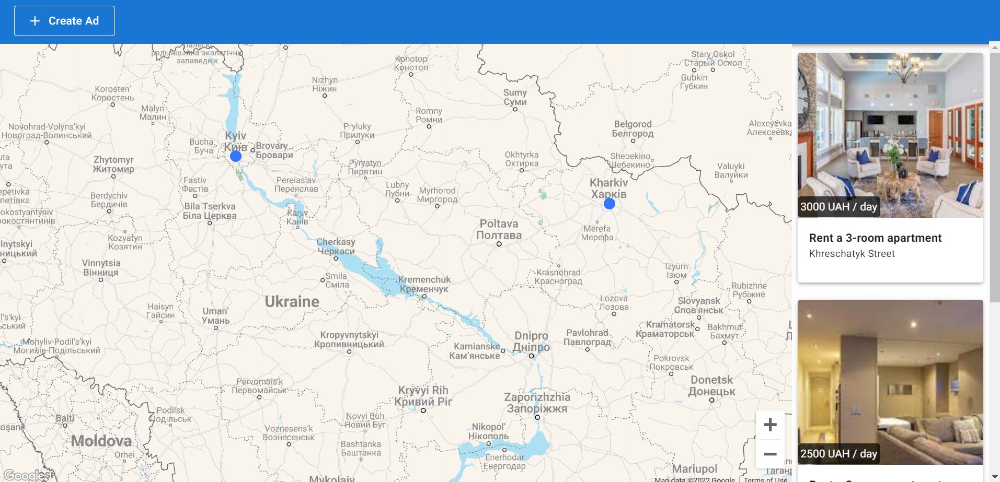

<div align="center">
  <br>
  <h1>Apartments Map</h1>
</div>

<!-- PROJECT SHIELDS -->
<div align="center">

   
   
   
   

</div>

<!-- ABOUT THE PROJECT -->
## About The Project



Apartments Map is a website whose main goal is to display apartment rental ads on the map.
A user hat the ability to add an ad. And after it has been added, a point appears on the map.
When a user clicks on a point on the map, information about it with a photo appears.
Apartment data is stored on a local JSON server.
In case of any changes by a user, the server reloads itself and the changes are automatically saved to a local JSON file. 

## Built With

* [TypeScript](https://www.typescriptlang.org/)
* [React](https://reactjs.org/) 
* [Axios](https://axios-http.com/)
* [Material-UI](https://mui.com/)
* [HTML](https://developer.mozilla.org/en-US/docs/Web/HTML) 
* [SCSS](https://sass-lang.com/) 

<!-- GETTING STARTED -->
## Getting Started

### Prerequisites

* [Git](https://git-scm.com)
* [Node.js](https://nodejs.org/en/download/)
* [npm](http://npmjs.com)

### Installation

```sh
# Step 1: Get a Google Maps API Key
$ Go to https://mapsplatform.google.com/

# Step 2: Clone the repository
$ git clone https://github.com/RadyaBen/Apartments-Map.git

# Step 3: Go into the repository 
$ cd Apartments-Map

# Step 4: Install NPM packages
$ npm install

# Step 5: Enter your API Key in MainPage.tsx 
$ const API_KEY = YOUR API KEY

# Step 6: Run the app 
$ npm start
```